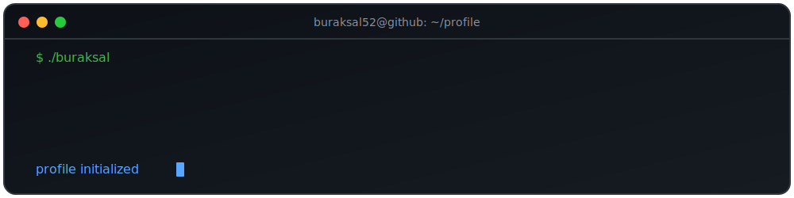

<p align="center">
  
</p>

<p align="center">
  
</p>

```text
┌──────────────────────────────────────────────────────────────────────────────┐
│ Burak SAL — ~/workspace                                           ● ● ●      │
├──────────────────────────────────────────────────────────────────────────────┤
│                                                                              │
│  $ tree ~/projects                                                           │
│                                                                              │
│  📁 ClinicAI                                                                 │
│  📁 Agent-Tale                                                               │
│  📁 LucidUI                                                                  │
│  📁 MIV-Blockspace                                                           │
│  📁 Physim                                                                   │
│                                                                              │
│  $ cat profile.md                                                            │
│                                                                              │
│  Name        :: Burak SAL                                                    │
│  Role        :: Backend Developer • AI Builder                               │
│  Stack       :: Python • Go • Flutter • FastAPI                              │
│                                                                              │
│  Research    :: Artificial Intelligence                                      │
│                 Blockchain                                                   │
│                 Quantum Computing                                            │
│                 Human–Computer Interaction                                   │
│                                                                              │
│  Mission     :: Turning research into products.                              │
│                                                                              │
│  $ █                                                                         │
│                                                                              │
└──────────────────────────────────────────────────────────────────────────────┘
```

---

# `about --verbose`

I enjoy building software where **research meets engineering**.

My primary interest is designing AI-powered systems and transforming ideas from research papers into practical products.

Instead of building projects only to learn a technology, I prefer identifying real-world problems, understanding the research behind them, and engineering solutions that people can actually use.

```yaml
Current Focus:
  - AI-powered Applications
  - Backend Engineering
  - Mobile Development
  - Product Engineering

Currently Exploring:
  - AI Agents
  - Blockchain
  - Distributed Systems
  - Quantum Computing
  - Human–Computer Interaction

Workflow:
  Science
      ↓
  Engineering
      ↓
  Product
```

---

# `tech-stack`

<p align="center">


</p>

---

# `ls featured-projects`

| Project | Description |
|---------|-------------|
| 🩺 **ClinicAI** | AI-powered appointment automation platform for clinics. |
| 🌐 **Agent Tale** | Flutter + Go application built on blockchain infrastructure. |
| 🎨 **LucidUI** | AI-assisted interface quality analysis and HCI research. |
| ⛓️ **MIV Blockspace** | Blockchain spam detection & MEV analytics. |
| ⚡ **Physim** | Interactive physics simulations for education. |

---

# `cat research_interests.md`

```text
Artificial Intelligence
├── AI Agents
├── Large Language Models
└── Applied AI

Software Engineering
├── Backend Systems
├── Product Engineering
└── Distributed Systems

Emerging Technologies
├── Blockchain
└── Quantum Computing

Human–Computer Interaction
```

---

# `git stats`

<p align="center">


</p>

<p align="center">


</p>

---

# `./contribution-snake`

<p align="center">


</p>

---

# `connect`

<p align="center">

<a href="https://linkedin.com/in/brksal">

</a>

<a href="https://medium.com/@brk52siz">

</a>

<a href="https://x.com/burak_shal">

</a>

<a href="mailto:brk52siz@gmail.com">

</a>

</p>

---

<p align="center">

> **Science → Engineering → Business**

*"Turning research into products."*

</p>
