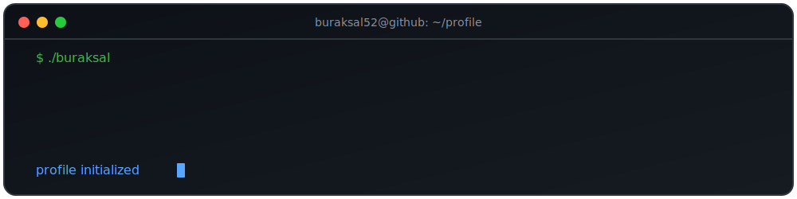

<p align="center">
  <picture>

    <source
      media="(prefers-color-scheme: dark)"
      srcset="./assets/header-dark.svg">

    <source
      media="(prefers-color-scheme: light)"
      srcset="./assets/header-light.svg">

    

  </picture>
</p>

```text
┌──────────────────────────────────────────────────────────────────────────────┐
│ Burak SAL — ~/workspace                                           ● ● ●      │
├──────────────────────────────────────────────────────────────────────────────┤
│                                                                              │
│  $ tree ~/projects                                                           │
│                                                                              │
│  ├── ClinicAI                                                                │
│  ├── Agent-Tale                                                              │
│  ├── LucidUI                                                                 │
│  ├── MIV-Blockspace                                                          │
│  └── Physim                                                                  │
│                                                                              │
│  $ cat profile.md                                                            │
│                                                                              │
│  Name        :: Burak SAL                                                    │
│  Role        :: Backend Developer • AI Builder                               │
│  Stack       :: Python • Go • Flutter • FastAPI                              │
│                                                                              │
│  Research    :: Artificial Intelligence                                      │
│                 Blockchain                                                   │
│                 Quantum Computing                                            │
│                 Human–Computer Interaction                                   │
│                                                                              │
│  Mission     :: Turning research into products.                              │
│                                                                              │
│  $ █                                                                         │
│                                                                              │
└──────────────────────────────────────────────────────────────────────────────┘
```

<p align="center">
  
</p>

<p align="center">
  
</p>

---

## `about --verbose`

I build software at the intersection of **research, engineering, and product development**.

My primary focus is designing AI-powered applications and the backend systems behind them. I enjoy taking ideas from research papers, technical problems, and emerging technologies, then transforming them into practical and testable products.

Rather than building projects only to learn a framework, I prefer starting with a meaningful problem, understanding its technical foundations, and engineering something people can actually use.

```yaml
focus:
  - AI-powered products
  - Backend engineering
  - Mobile application development
  - Research-driven prototyping
  - Product engineering

currently_exploring:
  - AI agents
  - Blockchain systems
  - Distributed systems
  - Quantum computing
  - Human–Computer Interaction

approach:
  science: understand the problem
  engineering: build a working system
  product: create something useful
  business: discover sustainable value
```

---

## `cat tech-stack.json`

<p align="center">
  
</p>

---

## `ls featured-projects/`

<table>
<tr>
<td width="50%" valign="top">

###  ClinicAI

AI-powered appointment automation platform designed for clinics and conversational patient interactions.

`FastAPI` `AI` `Automation` `SaaS`

</td>

<td width="50%" valign="top">

###  Agent Tale

A modern application developed with Flutter, Go, and blockchain infrastructure.

`Flutter` `Go` `Blockchain`

</td>
</tr>

<tr>
<td width="50%" valign="top">

###  LucidUI

UI quality analysis system combining HCI principles, computer vision, and automated design signals.

`HCI` `Computer Vision` `AI`

</td>

<td width="50%" valign="top">

###  MIV Blockspace

Blockchain analytics system for spam-pressure detection, transaction analysis, and gas-floor modelling.

`Python` `FastAPI` `Blockchain`

</td>
</tr>

<tr>
<td width="50%" valign="top">

###  Physim

Interactive web-based physics simulations designed to make physical concepts easier to explore.

`React` `Physics` `Simulation`

</td>

<td width="50%" valign="top">

### `next-project --status`

```text
Scanning research papers...
Finding an interesting problem...
Building the first prototype...
```

</td>
</tr>
</table>

---

## `cat research-interests.md`

```text
Artificial Intelligence
├── AI Agents
├── Large Language Models
├── Applied AI Systems
└── Research-driven Prototyping

Software Engineering
├── Backend Engineering
├── Distributed Systems
├── Product Engineering
└── Mobile Development

Emerging Technologies
├── Blockchain
└── Quantum Computing

Human–Computer Interaction
├── Interface Analysis
├── Design Signals
└── Human-centred AI
```

---

## `github achievements --summary`

<p align="center">
  
</p>

---

## `git stats`

<p align="center">
  

  
</p>

<p align="center">
  
</p>

---

## `git activity --last-31-days`

<p align="center">
  
</p>

---

## `./contribution-snake`

<p align="center">
  <picture>
    <source
      media="(prefers-color-scheme: dark)"
      srcset="https://raw.githubusercontent.com/buraksal52/buraksal52/gh-pages/github-contribution-grid-snake-dark.svg"
    />

    <source
      media="(prefers-color-scheme: light)"
      srcset="https://raw.githubusercontent.com/buraksal52/buraksal52/gh-pages/github-contribution-grid-snake.svg"
    />

    
  </picture>
</p>

---

## `open medium://latest`

<p align="center">
  I occasionally write about artificial intelligence, software engineering,
  emerging technologies, and research-driven product development.
</p>

<p align="center">
  <a href="https://medium.com/@brk52siz">
    
  </a>
</p>

---

## `connect --with-me`

<p align="center">
  <a href="https://linkedin.com/in/brksal">
    
  </a>

  <a href="https://medium.com/@brk52siz">
    
  </a>

  <a href="https://x.com/burak_shal">
    
  </a>

  <a href="mailto:brk52siz@gmail.com">
    
  </a>
</p>

---

<p align="center">
  <code>Science → Engineering → Business</code>
</p>

<p align="center">
  <i>Turning research into products.</i>
</p>
